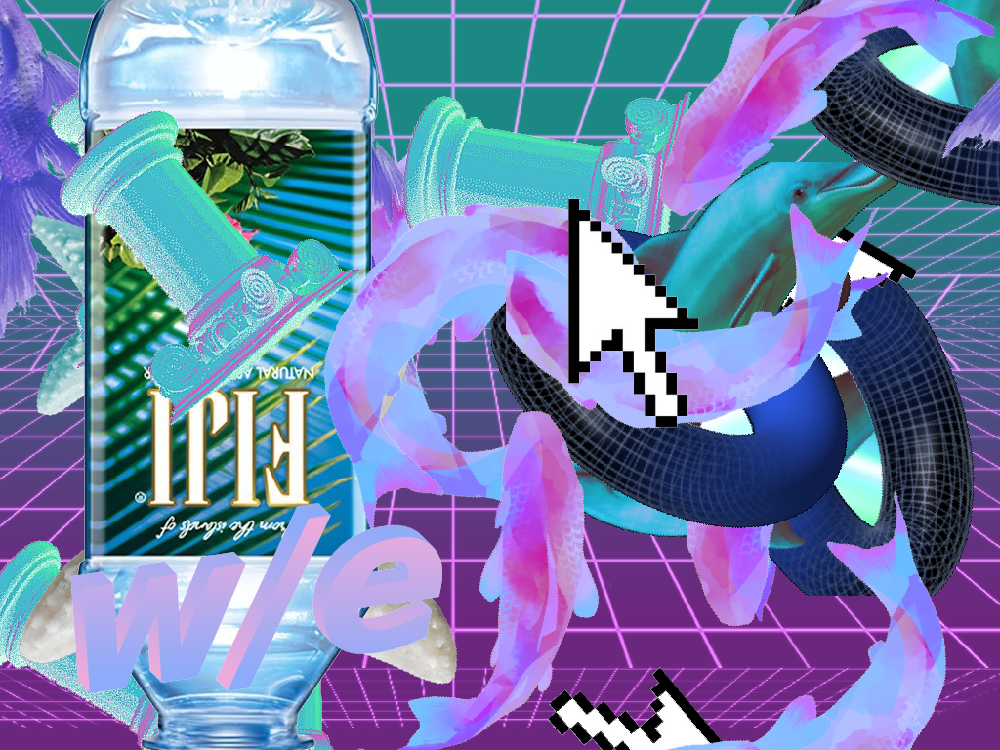
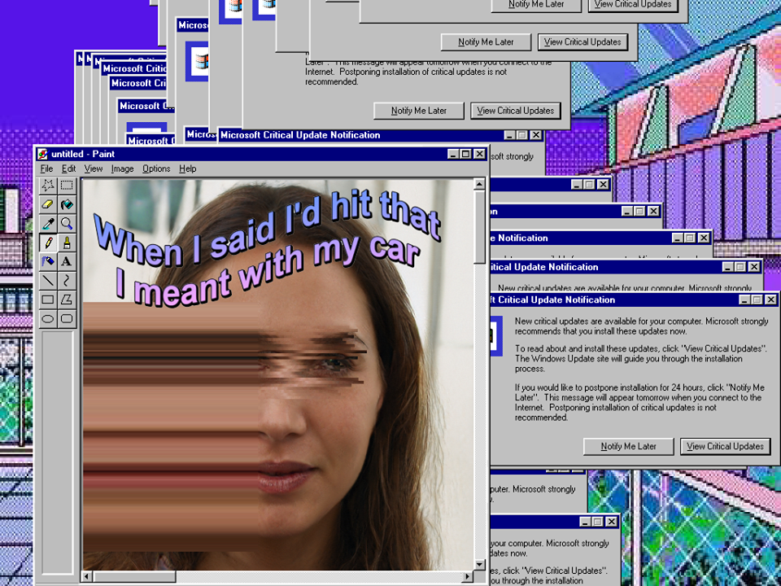

# A U T O A E S T H E T I C



[Vaporwave](https://en.wikipedia.org/wiki/Vaporwave) is a genre of electronic music defined by its heavy use of sampling and manipulating [mood music](https://en.wikipedia.org/wiki/Mood_music) from the 1980s and 90s.  This music is often accompanied by artwork that carries a very distinctive visual style which incorporates [glitch art](https://en.wikipedia.org/wiki/Glitch_art), [animation](https://en.wikipedia.org/wiki/Anime), and [cyberpunk](https://en.wikipedia.org/wiki/Cyberpunk) motifs while maintaining an air of irony.

This script randomly generates artwork that fit the Vaporwave aesthetic based on a set of image files.  The included <b>image_utils.py</b> and <b>face_utils.py</b> libraries contain some useful functions that will help take your Vaporwave look to the next level!  The former file includes functions for compositing images onto a background while the latter contains functions that can be used for glitching an image based on detected facial features.

## Dependencies

  * [Pillow](https://pillow.readthedocs.io/en/stable/)
  * [numpy](http://www.numpy.org/)

  <b>Optional:</b>

  * [OpenCV](https://opencv.org/)

You can use [pip](https://pypi.python.org/pypi/pip) to install any missing dependencies.

## Basic Usage

Vaporwave artwork can be generated simply by running the following command:

```
python vaporwave.py
```

Please note that a larger variety of images at your disposal will result in better looking artwork.  You're only limited by your creativity!  One such piece can be seen below:



## Acknowledgements

This project was inspired by and conceptually based on [rickyhan's](https://github.com/rickyhan/macintoshplus) and [TimChinenov's](https://github.com/TimChinenov/VaporWaveArt) vaporwave generators.
